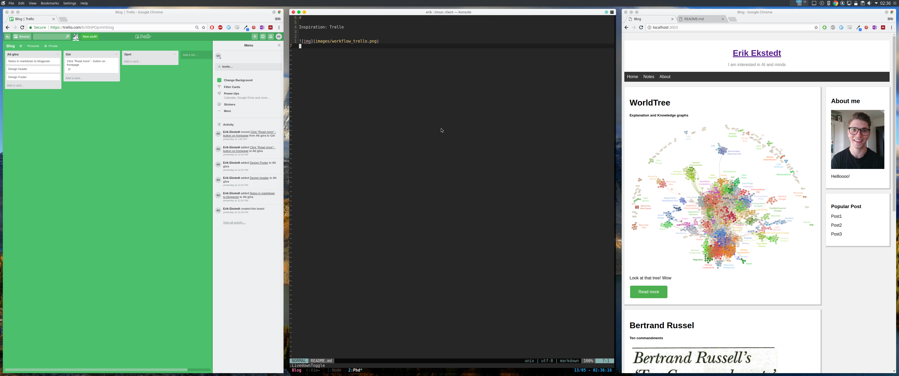

# Workflow

### **Inspiration:** Trello

* [x] [html]
Workflow has become a word of large importance both in a professional but also
for pleasure. Workflow is everything. What do you do during a day? Thats your
workflow. Workflow is a nice concept because it is what you want to
design/produce/understand, the reason why to design/produce/understand **and**
the tool to  design/produce/understand.

### **Goal:**
1. Explain the purpose of all windows(containers/doms?)
2. Explain their purpose for "reaching the goal"
3. Define "reaching the goal" (RTG)

---------------------------------

* [x] [html]
### Idea

The image in the Intro class: 
* Make it a video
* Dynamic representation of what one wishes to accomplish
  * Visualize your goals
* Write code to automate it
* Store data along the way
* Coding ideas and their relation

tools:
* [style.css](/style.css)

## RTG( phd, learning )

* learn concepts fast
* learn which concepts are more important to focus on

## RTG(enjoyment, creativity, relaxation)

* Music
* **Good** sound, speakers
* Programming 
* Gaming

------------------------------
* [ ] [html]
### Trello

* Important for structure and disciplin
* Record of progress
* Vim-keys ?

---------------------------------
