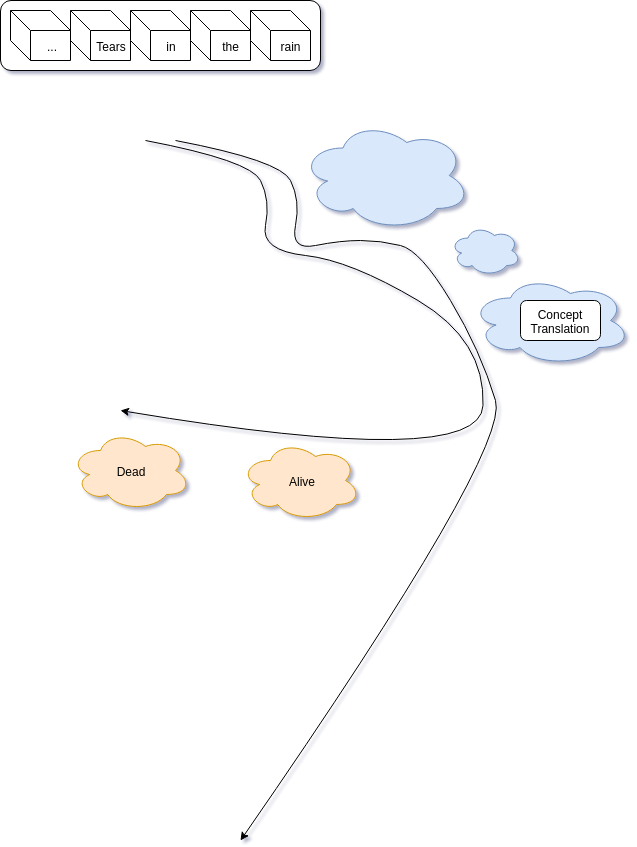

# Tears in the rain

## Translate the concept in tears in the rain quote to being dead or alive.
------------------------------------------------------------------------

Sketch from OneNote.
--------------------

Diagram from Drive.
-------------------

# NLP

Sentences, concepts of concepts, sequence of words:
* Tears in the rain
  * Tear:
  * initialized in emotion
  * emotion tear production
  * eye - nose - cheek - mix with raindrops - liquid and wetness - mixed in to the noise of rain
* The process of dying
  * consciousness process ending
  * Complexity process/computation
* Complexity is pattern from noise. They are orthogonal.
* Dying ending process making it indistinguishable from noise of not being alive.
