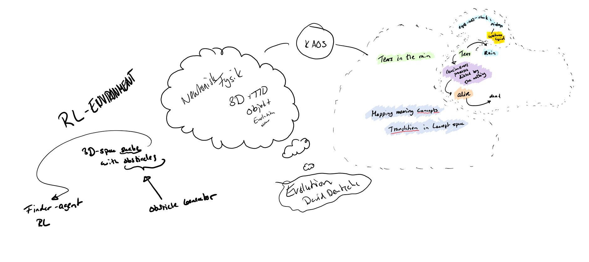

A fun exercise to do in order think about NLP is to explain poetic analogies. Use the "syntax" of NLP and find out what terms are good to use for certain concepts in certain circumstances.
NLP is about processing a combination of concepts and map them to other concepts. Words in themselfes are concepts and may be encoded in various ways through word embeddings. The most common approach
is word2vec approaches where the context in which a word is used determines the encoded semantical meanings of any word vector.

Illustration an example of concept relation.
Analogues in language [Surfaces and Essences](https://www.amazon.com/Surfaces-Essences-Analogy-Fuel-Thinking/dp/0465018475/ref=asap_bc?ie=UTF8) by Douglas Hofstadter. What is required knowledge in order to relate the act of death as "tears in the rain"?

## What is the quote?

> All those moments will be lost in time, like tears in rain.

The quote is a sentence, a concept of concepts, a sequence of words:
* Tears in the rain
  * What is the object **tear** in this sentence?

	* Initialized in emotion
	* Emotion tear production
	* Eye -> nose -> cheek -> mix with raindrops -> liquid and wetness 
	* Individual pattern disappears in noise
	* Going from something, uniqueness, individual meaning, objectness, existence to nothingness
	* Creation -> termination

* The process of dying
  * consciousness process ending
  * Complexity process/computation
  * Complexity is pattern from noise. They are orthogonal.
  * Dying ending process making it indistinguishable from noise of not being alive.

--------------

Vector similarities between "All those moments will be lost in time, like tears in rain"-vector and "dying" vector.
Meaning: "from something to nothing".
Associative meanings: "cooling", "dispersing", "towards uniformity"

Meaning is a specific journey towards the endstate.

